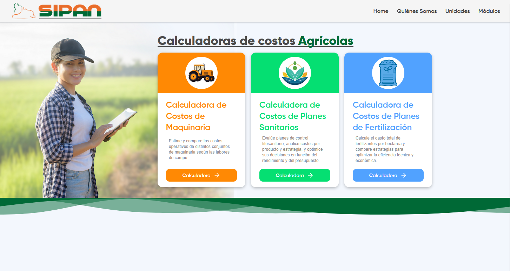
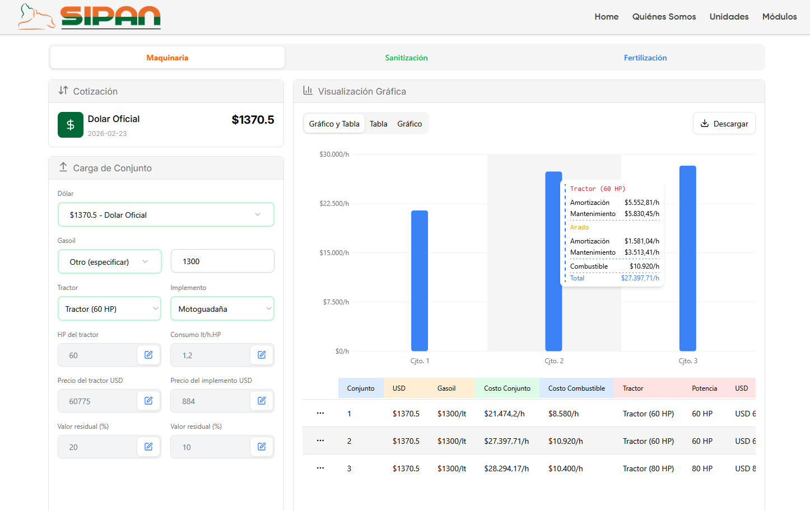
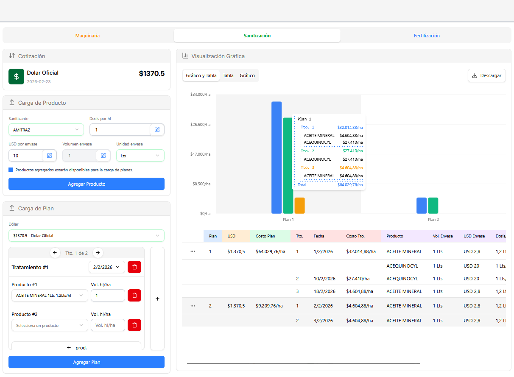

# 🌾 Calculadora de Costos Agropecuarios
Aplicación web desarrollada con TypeScript y React, en colaboración con [INTA](https://www.argentina.gob.ar/inta) y [SIPAN](https://sipan.inta.gob.ar/), utilizando su API oficial como fuente de datos.

- 🔗 Demo online:
👉 https://patagoniabit.com/

La herramienta permite estimar y comparar costos agropecuarios asociados a:
- 🚜 Maquinaria agrícola (Tractor + Implemento).
- 🧪 Planes con productos fitosanitarios.
- 🧴 Planes con productos fertilizantes.  

Ademas, de estas comparaciones permite obtener:
- 📊 Reportes exportables (PDF / Excel)

## 📸 Vista General
### Home
- Permite acceso a las calculadoras (Maquinaria, planes fitosanitarios y planes de fertilización).  


### Calculadoras
#### Ejemplo 1, comparación de Tractores + Implementos

- Formulario con selección de tractor y su implemento, cotización de USD y cotización de gasoil (izquierda)
- Permite la modificación de datos precargados de la API, mediante botones en los inputs.
- Comparación gráfica de los conjuntos cargados, botón para descarga de datos (derecha-arriba).
- Mediante la tabla, es posible eliminar conjuntos de la comparación (derecha-abajo).  

#### Ejemplo 2, comparación de planes fitosanitarios. 

- Formulario con carga de productos a utilizar (izquierda-arriba). 
- Carga de planes y tratamientos de cada plan (izquierda-abajo).
- Comparación gráfica de planes cargados, botón para descarga de datos (derecha-arriba)
- Mediante la tabla, es posible eliminar planes de la comparación (derecha-abajo).  

## 🧮 Funcionalidades
- Comparación de costos para Maquinaria + Implemento
- Comparación de costos para planes fitosanitarios y planes de fertilización
- Validación tipada de formularios
- Generación de reportes en PDF
- Exportación a Excel
- Interfaz responsive

## 🎯 Objetivo
Brindar una herramienta portable para:
- Productores agropecuarios
- Técnicos y asesores
- Estudiantes del sector

Los cálculos se basan en datos oficiales provistos por la API de [SIPAN](https://sipan.inta.gob.ar/).

## 🏗️ Stack Tecnológico

### Frontend
- React 19
- TypeScript
- Vite

### Gestión de Datos
- @tanstack/react-query
- Fetch API

### Formularios y Validación
- react-hook-form
- zod

### UI y Estilos
- TailwindCSS
- Radix UI

### Tablas y Visualización
- @tanstack/react-table
- recharts

### Exportación de Reportes
- pdfmake
- html-to-image
- xlsx (SheetJS)

## 🔌 Integración con API

La aplicación consume datos oficiales desde la API de [SIPAN](https://sipan.inta.gob.ar/), incluyendo:

- Listado de maquinaria (Tractores + Implementos)
- Productos fitosanitarios y fertilizantes  

También consume datos oficiales desde la API de [BCRA](https://bcra.gob.ar) para obtener la cotización de USD actualizada.

## 📁 Estructura del Proyecto
```
src/
 ├── api/
 ├── components/
 ├── context/
 ├── hooks/
 ├── layouts/
 ├── lib/
 ├── pages/
 ├── routes/
 ├── schemas/
 ├── services/
 ├── types/
 ├── utils/
 └── App.tsx
```

## ⚙️ Variables de Entorno

Crear un archivo .env en la raíz del proyecto:
```
# DOLLAR API
VITE_DOLLAR_API_URL=https://api.bcra.gob.ar

# GASOIL API
VITE_GASOIL_API_URL=http://datos.energia.gob.ar/

# SIPAN API 
# https://sipan.inta.gob.ar/ws/[endpoint].php
VITE_SIPAN_API_URL=https://sipan.inta.gob.ar/ws
# https://sipan.inta.gob.ar/ws/maquinaria.json.php
VITE_TOKEN_MAQUINARIAS=tu_api_key1
# https://sipan.inta.gob.ar/ws/productos.json.php
VITE_TOKEN_PRODUCTOS=tu_api_key2
```

## 📦 Instalación
```
git clone https://github.com/Niicoph/INTA-client
cd INTA-client
npm install
npm run dev
```

## 🤝 Colaboración Institucional
Este proyecto se desarrolló en articulación con [INTA](https://www.argentina.gob.ar/inta) y [SIPAN](https://sipan.inta.gob.ar/).

## 👥 Equipo de Desarrollo

  - [FAI-3169] Benitez, Franco Fabian - fabian.benitez@est.fi.uncoma.edu.ar
  - [FAI-4594] Pesce, Matías Nicolás - matias.pesce@est.fi.uncoma.edu.ar
  - [FAI-3220] Reyes Castelló, José Vicente - jose.reyes@est.fi.uncoma.edu.ar
